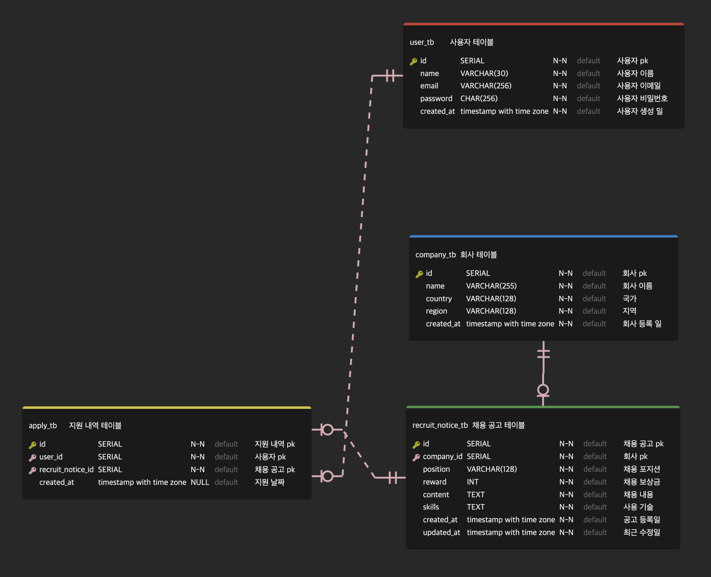

# wanted-pre-onboarding-backend

# 요구사항 분석
    - 회사는 채용 공고를 등록하고 관리할 수 있음 (수정, 삭제).
    - 사용자는 회사가 올린 채용 공고를 확인할 수 있음.
    - 사용자는 채용 공고에 지원할 수 있음
    - 회사는 해당 공고의 지원 내역을 확인할 수 있음.

### 사용 기술
    Node & Express.js (api 라우팅)
    Json Web Token (로그인)
    DBMS (postgresql)

### NPM
    "bcrypt": "^5.1.1", (비밀번호 암호화 목적)
    "cookie-parser": "^1.4.6",
    "dotenv": "^16.3.1",
    "express": "^4.18.2",
    "jsonwebtoken": "^9.0.2", (로그인 유지 목적)
    "nodemon": "^3.0.1", (개발용)
    "pg": "^8.11.3" (postgresql과 express를 연결해주는 목적)

# ERD 설계
- **tool: ERD editor (Visual Studio Code)**

